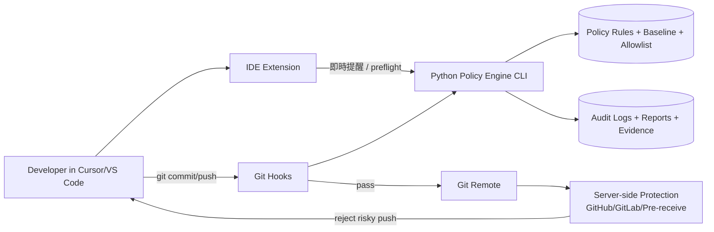
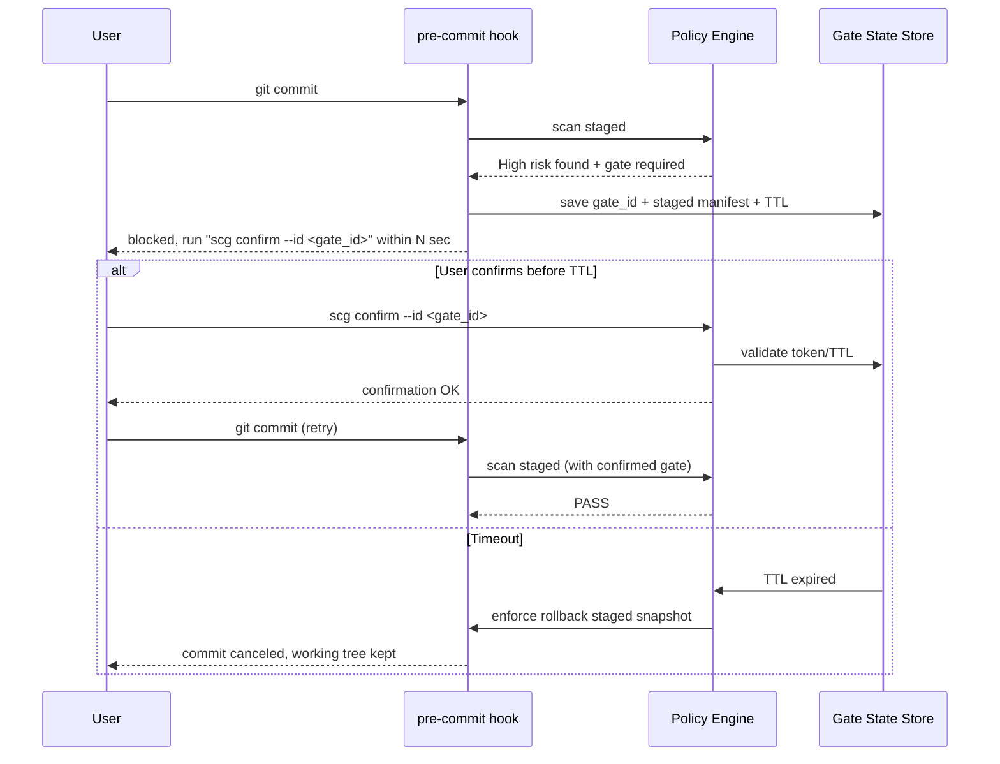
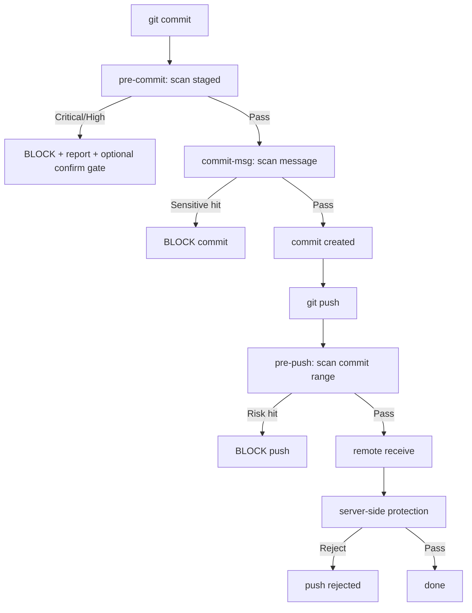

# AI 加速開發下的人為失誤防護系統設計

## 0) 目標與設計原則

**核心目標**：在 AI 提升產出速度的情境下，建立「多層防線」避免敏感資訊或高風險變更被誤提交/誤推送。

**設計原則**：

1. **Shift Left + Defense in Depth**：IDE 提早提醒，Git hooks 本機強制，server-side 最終攔截。
2. **可恢復性優先**：阻擋流程不破壞 working tree，優先 rollback staged/commit 流程。
3. **可解釋性**：每次阻擋都要有 rule id、證據片段、修復建議。
4. **可治理性**：規則版本化、allowlist/exception 有審計紀錄。
5. **低誤報策略**：多訊號加權（pattern + entropy + 檔案上下文）分級。

---

## 1) 整體系統架構



### 主要元件

- **IDE Extension（提醒層）**：即時檢測、review gate UI、風險摘要。
- **Python Policy Engine（判斷核心）**：統一規則執行、風險評分、報告輸出。
- **Git Hooks（本機強制）**：pre-commit / commit-msg / pre-push 對應不同掃描面。
- **Server-side（最終防線）**：阻止 `--no-verify` 繞過造成的風險上傳。

---

## 2) Python Policy Engine 模組切分

建議 package：`safe_commit_guard/`

```text
safe_commit_guard/
  cli.py
  engine/
    runner.py
    context.py
    severity.py
    exceptions.py
  scanners/
    secret_scanner.py
    file_scanner.py
    commitmsg_scanner.py
    diff_anomaly_scanner.py
    binary_scanner.py
  detectors/
    regex_patterns.py
    entropy.py
    structured_detectors.py
  git/
    staged.py
    commits.py
    refs.py
    patch.py
  policy/
    rules.yaml
    thresholds.yaml
    allowlist.yaml
    denylist.yaml
  workflow/
    confirm_gate.py
    rollback.py
    state_store.py
  report/
    formatter_json.py
    formatter_text.py
    formatter_sarif.py
  integrations/
    gitleaks_adapter.py
    detect_secrets_adapter.py
  tests/
```

### 關鍵模組職責

- `engine.runner`：統一執行流程，聚合 scanner 結果並輸出最終 verdict（PASS/WARN/BLOCK）。
- `scanners.*`：各領域檢測器，回傳標準化 finding：
  - `rule_id`
  - `severity`
  - `location`（file, line, commit, message）
  - `evidence_hash`（避免直接記錄明文 secret）
  - `fix_hint`
- `workflow.confirm_gate`：高風險命中後進入確認流程（TTL + token + 狀態檔）。
- `workflow.rollback`：只 rollback staged/commit 狀態，不碰 working tree。
- `integrations.*`：包裝 gitleaks / detect-secrets，輸出統一 finding schema。

### CLI 介面（MVP）

```bash
scg scan staged --format text
scg scan commit-msg --msg-file .git/COMMIT_EDITMSG
scg scan pre-push --range <local_sha>..<remote_sha>
scg confirm --id <gate_id>
scg rollback --id <gate_id>
```

---

## 3) Hook 職責分工（強烈建議）

## pre-commit（快且準）

**輸入**：staged files + staged diff

**檢查**：

- secret patterns（API key、token、password、private key header）
- 高風險檔案（`.env`, `.pem`, `.key`, `.p12`, `id_rsa` 等）
- 異常 diff（單檔大量新增、base64 長段、binary 誤入）
- denylist/allowlist

**策略**：

- High/Critical：直接 BLOCK
- Medium：WARN + 可進入 confirm gate

## commit-msg（小而硬）

**輸入**：`.git/COMMIT_EDITMSG`

**檢查**：

- commit message 洩漏 secrets
- 內網位址、帳號、客戶識別資訊等模式
- 不合規格式（可選：Conventional Commits）

**策略**：命中敏感資料即 BLOCK

## pre-push（重掃 + 防繞過）

**輸入**：即將推送的 commit range

**檢查**：

- 所有 commits 的 message + patch
- binary/cert/dump/憑證檔案
- 歷史遺漏（有人 `--no-verify`）

**策略**：

- Critical：BLOCK push
- High：BLOCK 或 require server-side override（依組織政策）

---

## 4) Cursor / VS Code Extension UI/UX 規劃

### 即時風險提示

- 編輯器 diagnostics（波浪線 + hover 解釋 + 修復建議）
- 檔案 explorer badge（高風險副檔名紅色標記）
- Status bar risk score（Low/Medium/High）

### 提交前 review gate

- 顯示 staged diff 摘要：
  - 新增/刪除行數
  - 檔案數、rename 數
  - 高風險命中清單
- 強制勾選：
  - 「我已 review diff」
  - 「我確認此變更不含敏感資訊」
- 點擊「Open Full Diff」快速跳轉 source control 檢視

### Commit Message 防護

- message editor lint
- 命中敏感 pattern 時 disable commit 按鈕
- 建議改寫（自動遮罩可疑字串）

---

## 5) 「提交前 confirm / timeout rollback」流程設計



### Gate 狀態資料（`.git/scg/`）

- `gate_id.json`：
  - `created_at`, `expires_at`
  - `risk_summary`
  - `staged_fingerprint`（index tree hash）
  - `status`（pending/confirmed/expired/rolled_back）
- `snapshot.patch`：可回溯 staged 狀態

### rollback 策略（安全優先）

- 首選：`git restore --staged <files>` 或重建 index
- 禁止：自動刪除 working tree 使用者內容
- 顯示 recovery 指令：
  - `git stash push -k`（保留 index 的替代流程）
  - `git apply .git/scg/snapshot.patch`

---

## 6) 規則分類（Rule Taxonomy）

## A. Secret Detection

- Regex：常見 API key、JWT、cloud tokens
- Entropy：高熵長字串
- Context：關鍵字鄰近（`password=`, `Authorization:`）
- PEM/PKCS 標頭

## B. Risky Files

- 副檔名：`.env`, `.pem`, `.key`, `.p12`, `.pfx`, `.crt`, `.kube/config`
- 檔名：`id_rsa`, `credentials.json`, `secrets.yml`
- 路徑：`config/prod/`, `infra/secrets/`

## C. Commit Message Leakage

- secret pattern
- 內網 IP / URL
- 客戶識別資訊（可配置 regex）

## D. Diff Anomaly

- 單次新增行數超閾值
- 突然大量 rename / binary
- 長段 base64
- 壓縮檔/dump/sql backup

## E. Policy Enforcement

- 必填 review confirmation
- 白名單例外需 ticket id
- 例外自動過期

---

## 7) 現成工具整合建議

## pre-commit framework

- 用 `pre-commit` 管理 hooks 安裝與版本釘選
- 優點：跨平台、團隊一致、升級可控

## gitleaks

- 放在 pre-commit / pre-push 的 secret 掃描主力
- 使用自訂 rules + baseline

## detect-secrets

- 適合 baseline 工作流與增量掃描
- 可當第二意見降低誤判

## GitHub / GitLab server-side

- GitHub secret scanning + push protection
- GitLab push rules / server hooks
- 作用：防本機繞過，作最終拒收

### 建議整合策略

1. Engine 先做統一介面（adapter）
2. 先串 gitleaks（MVP）
3. 第二階段再加 detect-secrets 交叉驗證

---

## 8) MVP（先擋得住）

### MVP 範圍（你指定的版本）

- Python policy engine（CLI）
- pre-commit hook
- commit-msg hook
- pre-push hook
- text/json report
- 基本 allowlist/denylist

### MVP 任務切分

## Milestone 1：骨架與基礎檢測

1. 建立 CLI + finding schema
2. 實作 staged file/diff 讀取
3. secret regex + risky file 掃描
4. commit-msg 掃描

## Milestone 2：Hook 串接

1. `pre-commit` 呼叫 `scg scan staged`
2. `commit-msg` 呼叫 `scg scan commit-msg`
3. `pre-push` 呼叫 `scg scan pre-push`
4. exit code 約定（0 pass / 1 block / 2 error）

## Milestone 3：Confirm Gate（初版）

1. gate state store
2. TTL confirm command
3. timeout rollback staged（不動 working tree）

## Milestone 4：報告與治理

1. JSON report for CI ingestion
2. rule id + severity + fix hints
3. allowlist with expiry + reason

---

## 9) 建議實作順序（12 週示意）

1. **第 1-2 週**：CLI 骨架、rule engine、staged/commit-msg 掃描
2. **第 3-4 週**：pre-commit / commit-msg / pre-push 串接
3. **第 5-6 週**：gitleaks adapter + baseline/allowlist
4. **第 7-8 週**：confirm/timeout/rollback 流程
5. **第 9-10 週**：CI 與 server-side 規則對齊
6. **第 11-12 週**：VS Code/Cursor extension（UI 與 review gate）

---

## 10) Hook 流程圖（MVP）



---

## 11) 落地建議（可直接開始）

- 先寫 `rules.yaml` 的 20 條高信心規則（寧少勿濫）。
- pre-commit 先只擋 **Critical**，High 用 confirm gate，降低初期反彈。
- 每次 block 都要附上「下一步可執行命令」，減少開發者挫折。
- 每週檢討 false positive/negative，調整閾值與 allowlist。

這樣的路線會符合你的目標：**先做得住（enforcement），再做得好用（UX）**。
